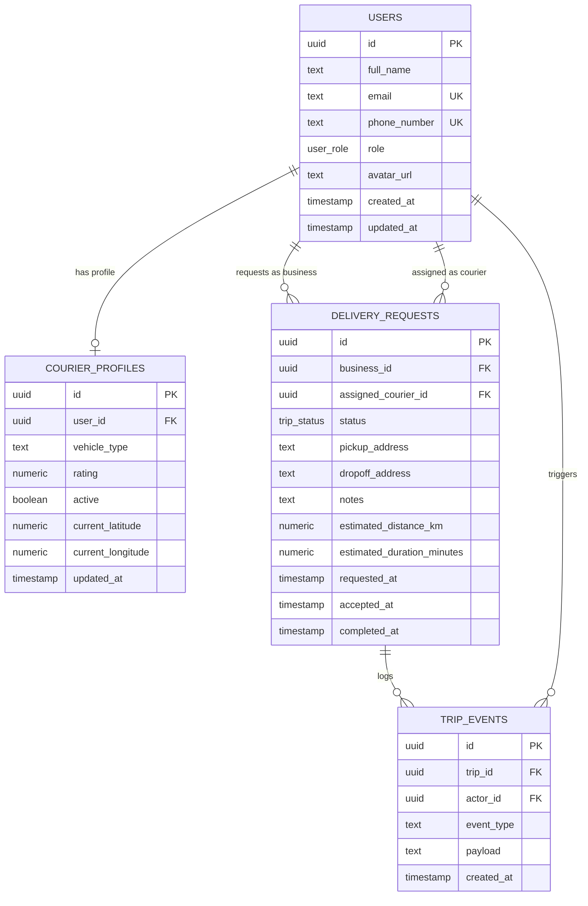

# Database Entity Relationship Diagram (ERD)

This document provides a visual representation of the YADA database schema as defined in [`src/lib/server/schema.ts`](file:///c:/Users/Kwakye/Documents/YADA/src/lib/server/schema.ts).

## Entity Relationship Diagram

## Enum Definitions

### 1. `user_role`
Determines the role and access privileges of a user:
*   `business`: The coordinator posting requests (e.g., Favorie).
*   `courier`: The dispatch driver fulfilling the requests.
*   `admin`: Administration staff.

### 2. `trip_status`
Manages the finite state machine for delivery lifecycles:
*   `requested`: Request posted by the business; looking for couriers.
*   `accepted`: Accepted by a courier; courier is preparing.
*   `courier_arriving`: Courier is en route to pick up the delivery.
*   `arrived`: Courier has arrived at the pickup location.
*   `in_progress`: Courier has picked up the delivery and is heading to the drop-off.
*   `completed`: Delivery successfully dropped off.
*   `cancelled`: Cancelled by either party.
